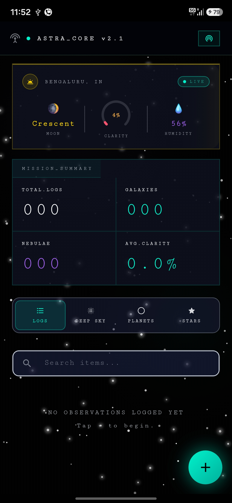
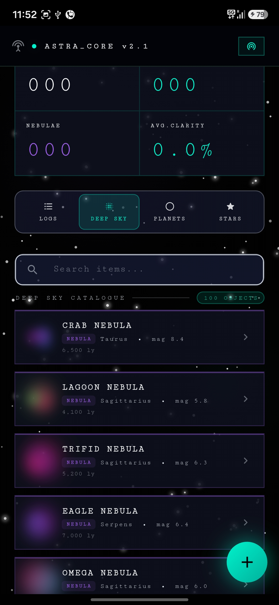
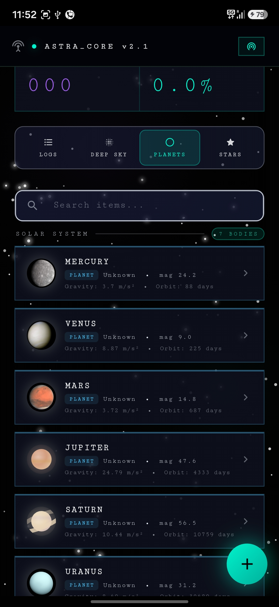
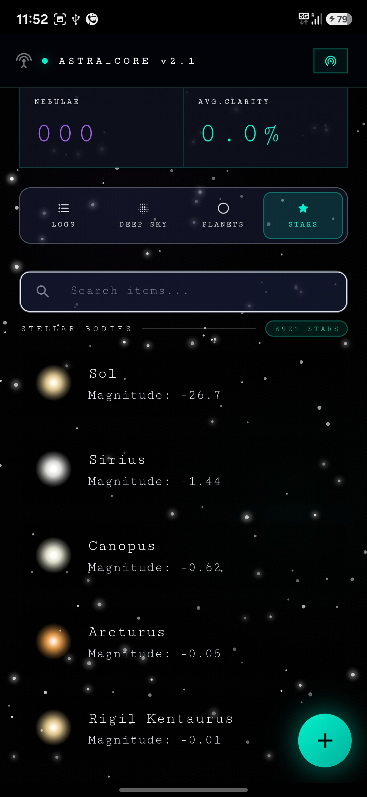
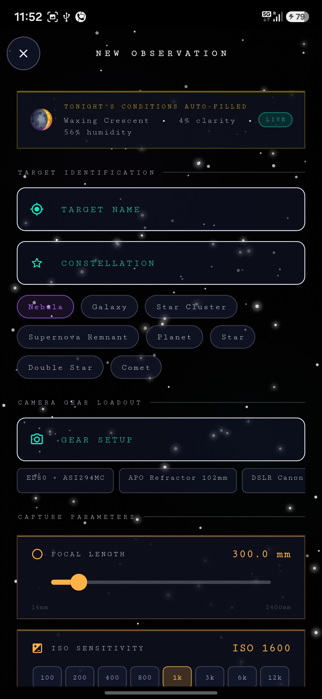
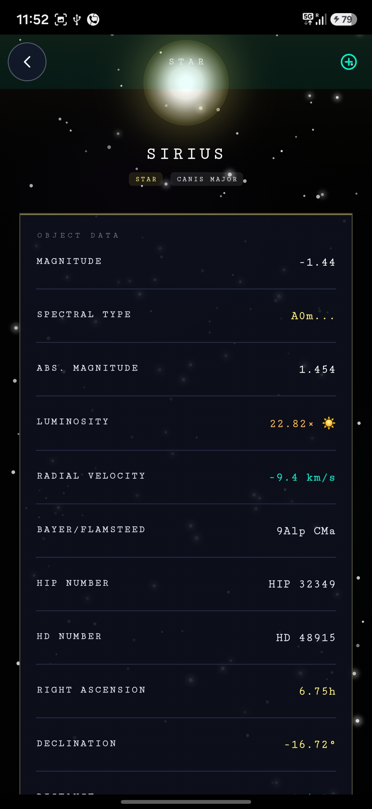
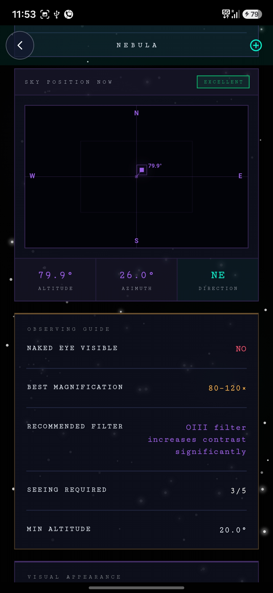

# ASTRA_CORE 🌌

A mobile astronomy app I built with Flutter. The idea was simple — I wanted something that actually tells you what's in the sky tonight, lets you log your observations, and looks cool doing it.

---

## Screenshots

| Dashboard | Deep Sky | Planets | Stars |
|---|---|---|---|
|  |  |  |  |

| Log Form | Star Detail | Nebula Detail |
|---|---|---|
|  |  |  |

## Demo Video

[▶ Watch Demo](screenshots/Video%20Project%201.mp4)
---

## What it does

- **Live sky conditions** — figures out your location automatically and pulls real cloud cover and humidity data so you know if tonight is worth setting up your gear
- **Moon phase tracker** — calculated from scratch using Julian Date math, no API needed
- **Deep sky catalogue** — 100+ objects (nebulae, galaxies, star clusters) with proper observing notes, telescope views at different apertures, imaging tips and finding methods
- **Planet tracker** — grabs live planet positions from NASA's JPL Horizons API. Falls back to basic solar system data if the API is down
- **Star database** — the full HYG v4.2 catalogue (8000+ visible stars) stored locally in SQLite, queried by sky region
- **Sky position radar** — computes exactly where in the sky any object is right now (altitude + azimuth) based on your GPS coordinates using sidereal time math
- **Observation logger** — log your sessions with target name, gear, focal length, ISO, exposure time, Bortle class, moon phase, coordinates and notes. All saved locally
- **Realistic planet icons** — actual NASA/ESA photos for planets, procedurally drawn icons for everything else (star colour is even calculated from the B-V colour index)
- **Animated starfield** — 160 parallax stars with shimmer, a shooting star, and nebula glows in the background
- **Search** — filters across all tabs in real time

---

## Screens

1. **Dashboard** — live sky conditions at the top (location, moon phase, clarity, humidity), mission summary stats, then a tabbed view of your logs, the DSO catalogue, planets and stars
2. **Observation detail** — full breakdown of a logged session including a sky position radar, Bortle scale bar, session timeline graph and camera gear
3. **Object detail** — everything about a celestial object: coordinates, observing guide, what it looks like through different telescopes, astrophotography notes, finding method, and your previous observations of it
4. **Log form** — auto-fills tonight's conditions, you fill in target, gear, capture settings and notes

---

## Tech stack

- **Flutter + Dart**
- **SQLite** via `sqflite` — two databases: one for the bundled star catalogue asset, one for user observation logs
- **HTTP** — for live API calls
- **Custom painters** — all the graphics (sky radar, starfield, compass, arc meter, timeline graph) are drawn with `CustomPainter`, no image assets for UI

### APIs used (all free, no key needed)

| API | What I use it for |
|---|---|
| ipapi.co | Getting the observer's location |
| Open-Meteo | Cloud cover, humidity, wind speed |
| NASA JPL Horizons | Live planet RA/Dec/magnitude |
| le-systeme-solaire.net | Planet physical data (fallback) |
| Simbad TAP (CDS Strasbourg) | Extended DSO catalogue (fallback) |

---

## Setup

You need Flutter installed. If you don't have it: https://docs.flutter.dev/get-started/install

```bash
git clone https://github.com/kunjpatel007-gif/astra-core.git
cd astra-core
flutter pub get
flutter run
```

The app needs internet on first launch to fetch sky conditions and planet positions. Everything else (star catalogue, DSO catalogue) is bundled locally so it works offline too.

### Dependencies

```yaml
dependencies:
  flutter:
    sdk: flutter
  http: ^1.2.0
  sqflite: ^2.3.0
  path: ^1.9.0
```

---

## Project structure

```
lib/
└── main.dart                  # everything — models, services, screens, widgets

assets/
├── celestial_catalog.db       # HYG v4.2 star catalogue (SQLite)
└── celestial_objects.json     # curated DSO catalogue (100+ objects)

screenshots/
└── ...                        # app screenshots
```

Everything is in one dart file. It got long. I know.

---

## A few things I'm proud of

- The Alt/Az calculation is done from scratch in Dart — Julian Date → GMST → LST → Hour Angle → Altitude/Azimuth. No library, just math
- Star colours are physically accurate — the B-V colour index from the HYG catalogue is converted to an RGB value so each star icon is the right colour (you can see this in the Stars tab — Sol is yellow, Sirius is blue-white, Arcturus is orange)
- The app degrades gracefully — every API call has a fallback so if something is offline the app still works with embedded data
- Planet images are real NASA/ESA photos pulled from Wikimedia Commons — not illustrations

---

## APK

Download the latest APK from the [Releases](https://github.com/kunjpatel007-gif/astra-core/releases) tab.

---

## Built for

Android Club Technical Recruitment 2026
